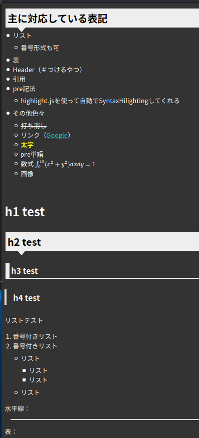
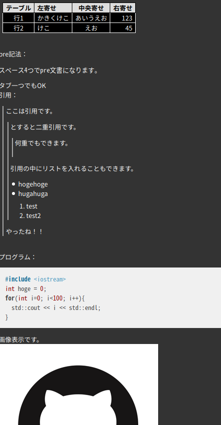

# Javascript markdown parser

Javascriptで書かれた単一ファイルの軽量マークダウンパーサーです。
MarkdownからHTMLに変換します。


以下のMarkdownをパースした結果がその下の画像になります


パース文章：
```md
# Markdown Parser!!(H1)
この文章は__Markdown__で書いています  
もとMarkdown文書は`index.html`を見て下さい

Header 1 Example

## 主に対応している表記
- リスト
  - 番号形式も可
- 表
- Header（＃つけるやつ）
- 引用
- pre記法
  - highlight.jsを使って自動でSyntaxHilightingしてくれる
- その他色々
  - ~~打ち消し~~
  - リンク（[Google](http://google.com)）
  - **太字**
  - `pre単語`
  - 数式 $\int_0^{10}(x^2 + y^2)dxdy = 1$
  - 画像
  
# h1 test
## h2 test
### h3 test
#### h4 test

リストテスト

1. 番号付きリスト
1. 番号付きリスト
    - リスト
        - リスト
        - リスト
    - リスト

水平線：
---

表：

|テーブル|左寄せ|中央寄せ|右寄せ|
|---|:---|:---:|---:|
| 行1 | かきくけこ | あいうえお | 123 |
| 行2 | けこ       | えお       | 45  |


pre記法：

    スペース4つでpre文書になります。
  タブ一つでもOK


引用：
> ここは引用です。  
> > とすると二重引用です。  
> > > 何重でもできます。  
> > 引用の中にリストを入れることもできます。
> > - hogehoge
> > - hugahuga
> >   1. test
> >   1. test2
> やったね！！


プログラム：
\```c
#include <iostream>
int hoge = 0;
for(int i=0; i<100; i++){
  std::cout << i << std::endl;
}
\```

画像表示です。


```


結果：



